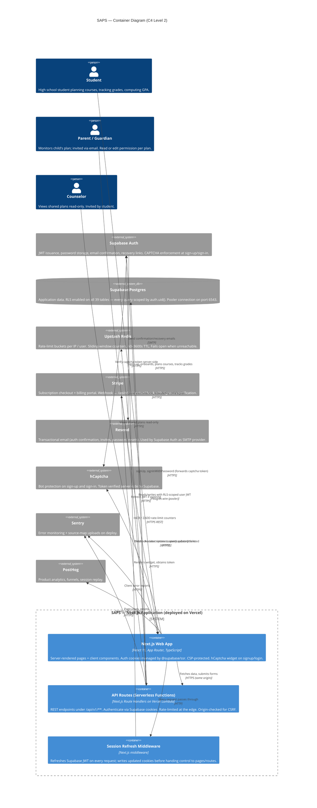

# SAPS Architecture — C4 Container View

> **Audience:** engineers new to the codebase, reviewers evaluating the security/operations posture, and future-self during architecture changes.
>
> **Level:** C4 Model — Container level. One level up from the code; one level down from the system context diagram. Shows the major runtime pieces and how they talk to each other.
>
> **Companion docs:** [`TECH_DESIGN_DOC.md`](./TECH_DESIGN_DOC.md) (implementation details), [`PRODUCTION_SETUP.md`](../operations/PRODUCTION_SETUP.md) (provisioning), [`LAUNCH_CHECKLIST.md`](../operations/LAUNCH_CHECKLIST.md) (go-live).
>
> **v1 scope note:** The **Counselor** persona in the container diagram below is **UI-hidden for v1** (postponed to a later release). Backend role model, RLS, and `counselor_student_links` are unchanged. See [docs/plans/v2-reenable-counselor.md](../plans/v2-reenable-counselor.md).

---

## Diagram



> **Rendering note:** GitHub, VS Code's markdown preview, and most modern Mermaid renderers support `C4Container`. If your viewer shows raw text, copy the block into [mermaid.live](https://mermaid.live) to render.

---

## Containers inside the SAPS boundary

### Next.js Web App
- **Code:** `saps/app/**` excluding `app/api/**`
- **Runtime:** Vercel edge + serverless render; static assets via Vercel CDN
- **Responsibilities:** render pages, run client-side React, manage session cookies via `@supabase/ssr`, render the hCaptcha widget when `NEXT_PUBLIC_HCAPTCHA_SITE_KEY` is set
- **Key auth surfaces:** `(auth)/signup`, `(auth)/login`, `(auth)/update-password`, `(onboarding)/onboarding`
- **CSP** (configured in [`saps/next.config.ts`](../../saps/next.config.ts)): allows self, Supabase, Stripe, PostHog, Upstash, hCaptcha origins

### API Routes (Serverless Functions)
- **Code:** `saps/app/api/v1/**/route.ts`
- **Runtime:** one AWS Lambda per route on Vercel
- **Responsibilities:** REST endpoints for every resource (plans, courses, grades, GPA, invites, Stripe webhooks)
- **Per-route pipeline:**
  1. `requireSameOrigin()` — CSRF check against `Origin` header (for mutating routes — signup has this *before* auth so bogus cross-origin requests 403 without leaking auth behavior)
  2. `requireAuth()` — resolves Supabase JWT from cookies
  3. `rateLimit()` — keyed by user ID (authenticated) or IP (anonymous routes)
  4. Zod validation of request body
  5. Drizzle query against Supabase Postgres (scoped by RLS)
  6. Typed JSON response

### Session Refresh Middleware
- **Code:** `saps/middleware.ts`
- **Runs on:** every request path (except static assets)
- **Responsibility:** call `supabase.auth.getUser()` before the page/API handler runs, which triggers a transparent JWT refresh if the access token is near expiry. Updated cookies are set on the outgoing response.

---

## External dependencies (outside SAPS trust boundary)

| System | Purpose | Why external |
|---|---|---|
| **Supabase Auth** | User identity, password storage, email confirmation, recovery, OAuth | Managed auth — avoids writing password hashing, email verification flows from scratch |
| **Supabase Postgres** | Single source of truth for all application data | Managed Postgres with RLS; the *only* persistence layer |
| **Upstash Redis** | Distributed rate-limit counters | Serverless functions have no shared memory; Redis is the shared state |
| **Stripe** | Subscription billing (Plus/Elite tiers) | Payment compliance (PCI) handled by Stripe |
| **Resend** | Transactional email delivery | Deliverability + domain reputation handled by Resend |
| **hCaptcha** | Bot protection on auth surfaces | Supabase-native integration, verified server-side |
| **Sentry** | Uncaught error capture + alerting | Observability outside the app boundary |
| **PostHog** | Product analytics + session replay | Analytics outside the app boundary |

---

## Trust boundaries

The single most important boundary is **Supabase Row-Level Security (RLS)**. Every user-data table has RLS enabled; every query is scoped by `auth.uid()`. This means:

- Even if an API route forgot to filter by user, RLS would block the query.
- Even if an attacker obtained a user's JWT, they can only see that user's rows.
- Verified 2026-04-15: parent reading student's `student_profiles` via raw PostgREST returns 0 rows.

Secondary boundaries:
- **CSRF (Origin check)** — all mutation routes require `Origin` to match `NEXT_PUBLIC_APP_URL`.
- **Rate limiting** — Upstash buckets cap brute-force attempts on `/auth/login`, `/auth/signup`, invite/join/claim flows.
- **CAPTCHA** — hCaptcha on sign-up and sign-in, enforced by Supabase.

---

## Key data flows

### 1. Signup (new student)
```
Browser → /signup page
         renders hCaptcha widget
         user submits form
Browser → POST /api/v1/auth/signup (captcha_token, email, password, ...)
         ├─ requireSameOrigin  → 403 if cross-origin
         ├─ rateLimit          → 429 if >5/min/IP
         ├─ zod.parse          → 400 if invalid
         └─ supabase.auth.signUp({ captchaToken })
                   ├─ supabase → hcaptcha.com /siteverify → ok/fail
                   ├─ supabase → resend (confirmation email)
                   └─ returns { user, session: null } (email confirmation pending)
Browser ← "Check your email" screen
```

### 2. Authenticated page load (dashboard)
```
Browser → GET /dashboard (cookies: sb-access-token, sb-refresh-token)
         middleware runs supabase.auth.getUser()
           → if access-token near expiry, refresh and set new cookies
         server component renders
           ├─ fetch server-side → /api/v1/accounts/me
           │      requireAuth → Supabase JWT resolved
           │      Drizzle query to Supabase Postgres (RLS-scoped)
           └─ returns user + account context
Browser ← HTML + hydration bundle
```

### 3. Rate-limited login attempt (6th try)
```
Browser → POST /api/v1/auth/login
         ├─ requireSameOrigin     → ok
         ├─ rateLimit(auth:login:<ip>, 5, 60)
         │      redis.zcard → count=6 (exceeds 5)
         │      returns { success: false }
         └─ route returns 429 { code: RATE_LIMITED, retry_after: 37 }
```

### 4. Stripe subscription webhook
```
Stripe → POST /api/v1/stripe/webhook (Stripe-Signature header, raw body)
        ├─ verify signature with STRIPE_WEBHOOK_SECRET
        ├─ parse event (customer.subscription.created/updated/deleted)
        └─ update subscriptions table in Supabase Postgres
           (bypasses RLS — uses service-role client for webhook processing)
```

---

## Deployment topology

| Container | Hosted on | Scaling |
|---|---|---|
| Next.js pages | Vercel Edge / CDN | Automatic, globally replicated |
| API routes | Vercel Lambda (us-east-1 by default) | Spawns per request, scales to zero |
| Middleware | Vercel Edge | Runs at edge POPs |
| Supabase Postgres | Supabase managed Postgres | Single primary, add replicas manually |
| Upstash Redis | Upstash global edge | Free tier sufficient for launch |
| Auth / email / payments | Supabase / Resend / Stripe | Managed, not our concern |

**All of the above are independently scalable.** No single container holds state that another cares about beyond short-lived HTTP calls.

---

## What this diagram intentionally omits

- **Code-level detail** (that belongs in [TECH_DESIGN_DOC.md](./TECH_DESIGN_DOC.md))
- **Auth role hierarchy** (student / parent / counselor; lives in schema docs)
- **Internal module boundaries** (`lib/gpa/`, `lib/prereq/`, etc.) — all inside the API Routes container
- **Testing infrastructure** (Vitest + Playwright are dev-time, not runtime)
- **CI / PR-review automation** (e.g. voice-guardian copy review at [`.github/workflows/voice-guardian.yml`](../../.github/workflows/voice-guardian.yml); CI lives outside the runtime trust boundary)
- **Python extractor** (`saps/extractor/`) — build-time only; outputs JSON consumed by `db:setup`

---

**Last updated:** 2026-04-15
